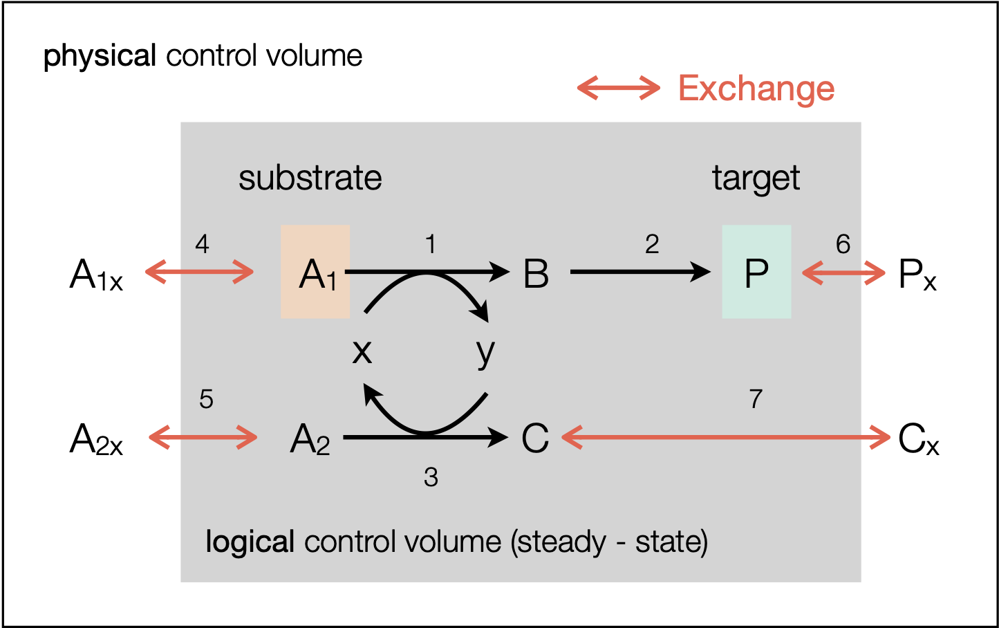

# Lab 7b: Iterative Solution of a System of Species Mole Balances
This lab will familiarize students with the iterative solution of a system of steady-state species mole balances for a well-mixed isothermal reaction operation. The steady-state open species mole balances for a well-mixed system with species set $\mathcal{M}$, 
reaction set $\mathcal{R}$, and stream set $\mathcal{S}$ is described by:
$$
\dot{\mathbf{N}}\cdot{\mathbf{d}} + \mathbf{S}\cdot\dot{\mathbf{\epsilon}} = \mathbf{0}
$$

The matrix $\dot{\mathbf{N}}\in\mathbb{R}^{\mathcal{M}\times\mathcal{S}}$ is the species flow matrix, 
$\mathbf{d}\in\mathbb{R}^{\mathcal{S}\times{1}}$ is the stream direction vector,
$\mathbf{S}\in\mathbb{R}^{\mathcal{M}\times\mathcal{R}}$ is the stoichiometric matrix, 
and $\dot{\mathbf{\epsilon}}\in\mathbb{R}^{\mathcal{R}\times{1}}$ is the open reaction extent vector.
The open species mole balances can also be written in index form as:
$$
\sum_{s\in\mathcal{S}}d_{s}\dot{n}_{is} + \sum_{j\in\mathcal{R}}\sigma_{ij}\dot{\epsilon}_{j} = 0\qquad{i=1,2,\dots,\mathcal{M}}
$$
where $\dot{n}_{is}$ is the mole flow rate of species $i$ in stream $s$ (units:mol/time), $d_{s}$ is the direction of stream $s$ (units: dimensionless),
$\sigma_{ij}$ is the stoichiometric coefficient for species $i$ in reaction $j$ (units: dimensionless), and $\dot{\epsilon}_{j}$ is the open extent of reaction $j$ (units: mol/time).

    

        
    

## Task 1: Compute the stoichiometric matrix $\mathbf{S}$ (together)
__Duration 15 min__: Together, let's analyze the codes to compute the stoichiometric matrix $\mathbf{S}$ for the reactions encoded in the [Toy.net](/data/Toy.net) file.
* Review the `readreactionfile` function in `src/Files.jl` to read the reaction file and return the reaction dictionary `R,` whose keys are the line number from [Toy.net](/data/Toy.net)   the list of `MyChemicalReactionModel` objects. 
* Review the `build` method for the `MyStoichiometricMatrixModel` type in `src/Factory.jl` to build the stoichiometric matrix $\mathbf{S}$ from the reaction dictionary `R.` 
* The `runme_task_1.jl` script gives an example of how the stoichiometric matrix implementations which reads the reaction files and computes the stoichiometric matrix $\mathbf{S}$ associated with the reactions in the [Toy.net](/data/Toy.net) file.

## Task 2: Setup the steady-state species mole balance system matrix $\mathbf{A}$ (together)
__Duration 15 min__: Assume that we have two streams in the system: stream 1 (enters the reactor), and stream 2 (exits the reactor). All species can be transported in all streams. No reaction occurs in the streams. Show that in the absence of information about the reaction extents or the input or output stream mole flows, the steady-state species mole balances can be written as
$$
\mathbf{A}\cdot\mathbf{x} = \mathbf{0}
$$
where $\mathbf{A}\in\mathbb{R}^{\mathcal{7}\times\mathcal{17}}$ is the system matrix, and $\mathbf{x}\in\mathbb{R}^{\mathcal{17}\times{1}}$ is the vector of unknowns. To see this, run the `runme_task_2.jl` script to setup the system matrix $\mathbf{A}$ as the block system:
$$
\mathbf{A} = \begin{bmatrix}
\mathbf{S} &|& \mathbf{D}_{1} &|& \mathbf{D}_{2} \\
\end{bmatrix}
$$
where $\mathbf{S}$ is the stoichiometric matrix, and $\mathbf{D}_{1}$ and $\mathbf{D}_{2}$ are diagonal matrices that represent the stream direction vectors for streams 1, 2, and 3, respectively.

### Discussion
* What are the unknowns in the `17`$\times$`1` unknown vector $\mathbf{x}$?
* What is the `rank` of the system matrix $\mathbf{A}\in\mathbb{R}^{n\times{m}}$, and what does that say about the system of equations? Reminder: $\text{rank}(\mathbf{A})\leq\min(n,m)$. You can use the [`rank(...)` function in Julia](https://docs.julialang.org/en/v1/stdlib/LinearAlgebra/#LinearAlgebra.rank) to compute the rank of the system matrix $\mathbf{A}$.

## Task 3: Let's put some numbers in and see what happens.
__Duration 20 min__: Assume that the system has two streams: stream 1 enters the reactor, and stream 2 exists the reactor. All species can be transported in all streams.
Further, we've measured some stream mole flows and want to compute the remaining unknown values (extents and missing mole flows). How do we set up the system matrix $\mathbf{A}$, the vector of unknowns $\mathbf{x}$, and the right-hand side vector $\mathbf{b}$? We've implemented some scenarios in the `runme_task_3.jl` script.
* __Case 1__: Assume we've measured all the inputs and want to estimate the reaction extents and the outputs. How do we set up the system matrix $\mathbf{A}$, the vector of unknowns $\mathbf{x}$, and the right-hand side vector $\mathbf{b}$? (and will the system be solvable?)
* __Case 2__: Assume we've measured all the the open extents, and the output stream. How do we set up the system matrix $\mathbf{A}$, the vector of unknowns $\mathbf{x}$, and the right-hand side vector $\mathbf{b}$? (and will the system be solvable?). Enter some numbers into the measurement vector `ndot_measured` of the `runme_task_3.jl` script and see what solution is generated by one of our favorite linear algebra solvers.
